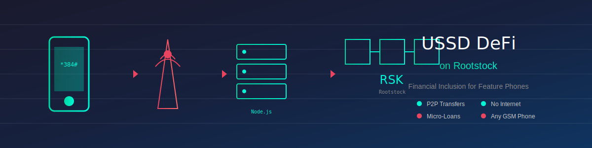

# USSD-Based Decentralized Finance System on Rootstock (RSK)

<p align="center">
  
</p>

## 📱 Bringing DeFi to Feature Phones

This tutorial demonstrates how to build a **USSD-based decentralized finance system** on the Rootstock (RSK) blockchain, enabling users with basic feature phones to access DeFi services without internet connectivity.

### The Problem We're Solving

Over **1.7 billion people** worldwide remain unbanked, with many lacking access to smartphones or reliable internet. Traditional DeFi solutions require:
- Smartphones with web browsers
- Stable internet connections
- Technical knowledge of wallets and blockchain

### Our Solution

By leveraging **USSD (Unstructured Supplementary Service Data)** — the same technology behind mobile money services like M-Pesa — we can provide:
- ✅ P2P cryptocurrency transfers
- ✅ Micro-loan services
- ✅ Account balance checks
- ✅ Transaction history

All accessible from any GSM phone by simply dialing a short code like `*384*123#`.

---

## 🏗️ System Architecture

```
┌─────────────────────────────────────────────────────────────────────────────┐
│                           USSD DeFi Architecture                            │
├─────────────────────────────────────────────────────────────────────────────┤
│                                                                             │
│  ┌──────────────┐     ┌──────────────────┐     ┌──────────────────────────┐│
│  │              │     │                  │     │                          ││
│  │  Feature     │────▶│  Telecom         │────▶│  Africa's Talking        ││
│  │  Phone       │     │  Network (GSM)   │     │  USSD Gateway            ││
│  │              │◀────│                  │◀────│                          ││
│  └──────────────┘     └──────────────────┘     └───────────┬──────────────┘│
│                                                            │               │
│                                                            ▼               │
│                                               ┌──────────────────────────┐ │
│                                               │   Node.js Backend        │ │
│                                               │   ┌──────────────────┐   │ │
│                                               │   │ USSD Handler     │   │ │
│                                               │   │ Session Manager  │   │ │
│                                               │   │ PIN Verification │   │ │
│                                               │   └────────┬─────────┘   │ │
│                                               │            │             │ │
│                                               │   ┌────────▼─────────┐   │ │
│                                               │   │ Web3 Integration │   │ │
│                                               │   │ Wallet Manager   │   │ │
│                                               │   │ TX Builder       │   │ │
│                                               │   └────────┬─────────┘   │ │
│                                               └────────────┼─────────────┘ │
│                                                            │               │
│                                                            ▼               │
│  ┌─────────────────────────────────────────────────────────────────────┐   │
│  │                      Rootstock Blockchain                           │   │
│  │  ┌───────────────────────┐    ┌───────────────────────────────┐     │   │
│  │  │   WalletRegistry.sol  │    │     MicroLoan.sol             │     │   │
│  │  │   - Phone mapping     │    │     - Request loans           │     │   │
│  │  │   - Wallet creation   │    │     - Collateral management   │     │   │
│  │  │   - Balance queries   │    │     - Interest calculation    │     │   │
│  │  └───────────────────────┘    │     - Repayment handling      │     │   │
│  │                               └───────────────────────────────┘     │   │
│  │  ┌───────────────────────┐                                          │   │
│  │  │   P2PTransfer.sol     │    Native RBTC for transactions          │   │
│  │  │   - Send funds        │                                          │   │
│  │  │   - Receive funds     │                                          │   │
│  │  │   - TX history        │                                          │   │
│  │  └───────────────────────┘                                          │   │
│  └─────────────────────────────────────────────────────────────────────┘   │
│                                                                             │
└─────────────────────────────────────────────────────────────────────────────┘
```

---

## 📚 Table of Contents

1. [Prerequisites](#-prerequisites)
2. [Project Setup](#-project-setup)
3. [Smart Contract Development](#-smart-contract-development)
4. [Backend Server Implementation](#-backend-server-implementation)
5. [USSD Menu Flow Design](#-ussd-menu-flow-design)
6. [Security Considerations](#-security-considerations)
7. [Testing Guide](#-testing-guide)
8. [Deployment](#-deployment)
9. [API Reference](#-api-reference)

---

## 🔧 Prerequisites

Before starting, ensure you have:

- **Node.js** v18+ and npm
- **Hardhat** for smart contract development
- **Africa's Talking Account** for USSD gateway
- **RSK Testnet RBTC** for testing (get from [RSK Faucet](https://faucet.rsk.co/))

### Required Knowledge

- Basic Solidity programming
- Node.js/Express.js development
- Understanding of blockchain transactions

---

## 🚀 Project Setup

### 1. Clone and Install Dependencies

```bash
# Create project directory
mkdir ussd-rsk-defi
cd ussd-rsk-defi

# Initialize npm project
npm init -y

# Install dependencies
npm install express body-parser ethers dotenv helmet cors express-rate-limit
npm install --save-dev hardhat @nomicfoundation/hardhat-toolbox
```

### 2. Initialize Hardhat

```bash
npx hardhat init
```

Select "Create a JavaScript project" when prompted.

### 3. Configure Environment Variables

Create a `.env` file in the project root:

```env
# RSK Network Configuration
RSK_TESTNET_RPC=https://public-node.testnet.rsk.co
RSK_MAINNET_RPC=https://public-node.rsk.co

# Deployer wallet (KEEP SECURE!)
DEPLOYER_PRIVATE_KEY=your_private_key_here

# Backend wallet for gas fees
BACKEND_WALLET_PRIVATE_KEY=your_backend_wallet_private_key

# Africa's Talking Credentials
AT_API_KEY=your_africas_talking_api_key
AT_USERNAME=your_username

# Server Configuration
PORT=3000
SESSION_SECRET=your_session_secret_here

# Contract Addresses (populated after deployment)
WALLET_REGISTRY_ADDRESS=
P2P_TRANSFER_ADDRESS=
MICRO_LOAN_ADDRESS=
```

---

## 📜 Smart Contract Development

### Contract 1: WalletRegistry.sol

This contract maps phone numbers to blockchain wallets, enabling users to transact using just their phone numbers.

```solidity
// SPDX-License-Identifier: MIT
pragma solidity ^0.8.19;

import "@openzeppelin/contracts/access/Ownable.sol";
import "@openzeppelin/contracts/security/ReentrancyGuard.sol";

/**
 * @title WalletRegistry
 * @notice Maps phone number hashes to wallet addresses for USSD-based DeFi
 * @dev Phone numbers are hashed for privacy before storage
 */
contract WalletRegistry is Ownable, ReentrancyGuard {
    
    // Mapping from phone hash to wallet address
    mapping(bytes32 => address) private phoneToWallet;
    
    // Mapping from wallet to phone hash (for reverse lookup)
    mapping(address => bytes32) private walletToPhone;
    
    // Mapping to store hashed PINs for authentication
    mapping(bytes32 => bytes32) private phoneToPinHash;
    
    // Registration status
    mapping(bytes32 => bool) private isRegistered;
    
    // Events
    event WalletRegistered(bytes32 indexed phoneHash, address indexed wallet);
    event WalletUpdated(bytes32 indexed phoneHash, address indexed newWallet);
    event PinUpdated(bytes32 indexed phoneHash);
    
    // Authorized backend addresses that can call sensitive functions
    mapping(address => bool) public authorizedBackends;
    
    modifier onlyAuthorized() {
        require(authorizedBackends[msg.sender] || msg.sender == owner(), "Not authorized");
        _;
    }
    
    constructor() Ownable(msg.sender) {
        authorizedBackends[msg.sender] = true;
    }
    
    /**
     * @notice Register a new wallet for a phone number
     * @param phoneHash Keccak256 hash of the phone number
     * @param wallet The wallet address to associate
     * @param pinHash Keccak256 hash of the user's PIN
     */
    function registerWallet(
        bytes32 phoneHash,
        address wallet,
        bytes32 pinHash
    ) external onlyAuthorized {
        require(!isRegistered[phoneHash], "Phone already registered");
        require(wallet != address(0), "Invalid wallet address");
        require(walletToPhone[wallet] == bytes32(0), "Wallet already registered");
        
        phoneToWallet[phoneHash] = wallet;
        walletToPhone[wallet] = phoneHash;
        phoneToPinHash[phoneHash] = pinHash;
        isRegistered[phoneHash] = true;
        
        emit WalletRegistered(phoneHash, wallet);
    }
    
    /**
     * @notice Get wallet address for a phone hash
     * @param phoneHash Keccak256 hash of the phone number
     * @return The associated wallet address
     */
    function getWallet(bytes32 phoneHash) external view returns (address) {
        return phoneToWallet[phoneHash];
    }
    
    /**
     * @notice Check if a phone number is registered
     * @param phoneHash Keccak256 hash of the phone number
     * @return Registration status
     */
    function checkRegistration(bytes32 phoneHash) external view returns (bool) {
        return isRegistered[phoneHash];
    }
    
    /**
     * @notice Verify PIN for a phone number
     * @param phoneHash Keccak256 hash of the phone number
     * @param pinHash Keccak256 hash of the provided PIN
     * @return Whether the PIN is correct
     */
    function verifyPin(bytes32 phoneHash, bytes32 pinHash) external view returns (bool) {
        return phoneToPinHash[phoneHash] == pinHash;
    }
    
    /**
     * @notice Update PIN for a phone number
     * @param phoneHash Keccak256 hash of the phone number
     * @param newPinHash Keccak256 hash of the new PIN
     */
    function updatePin(bytes32 phoneHash, bytes32 newPinHash) external onlyAuthorized {
        require(isRegistered[phoneHash], "Phone not registered");
        phoneToPinHash[phoneHash] = newPinHash;
        emit PinUpdated(phoneHash);
    }
    
    /**
     * @notice Add an authorized backend address
     * @param backend Address to authorize
     */
    function addAuthorizedBackend(address backend) external onlyOwner {
        authorizedBackends[backend] = true;
    }
    
    /**
     * @notice Remove an authorized backend address
     * @param backend Address to remove
     */
    function removeAuthorizedBackend(address backend) external onlyOwner {
        authorizedBackends[backend] = false;
    }
}
```

### Contract 2: P2PTransfer.sol

Handles peer-to-peer transfers using phone numbers as identifiers.

```solidity
// SPDX-License-Identifier: MIT
pragma solidity ^0.8.19;

import "@openzeppelin/contracts/security/ReentrancyGuard.sol";
import "@openzeppelin/contracts/access/Ownable.sol";

interface IWalletRegistry {
    function getWallet(bytes32 phoneHash) external view returns (address);
    function checkRegistration(bytes32 phoneHash) external view returns (bool);
}

/**
 * @title P2PTransfer
 * @notice Enables P2P transfers between phone-registered wallets
 */
contract P2PTransfer is ReentrancyGuard, Ownable {
    
    IWalletRegistry public walletRegistry;
    
    // Transaction record for history
    struct Transaction {
        bytes32 fromPhoneHash;
        bytes32 toPhoneHash;
        uint256 amount;
        uint256 timestamp;
        string memo;
    }
    
    // Transaction history per phone hash
    mapping(bytes32 => Transaction[]) private transactionHistory;
    
    // Fee configuration (basis points, 100 = 1%)
    uint256 public transferFeeBps = 50; // 0.5% default
    uint256 public constant MAX_FEE_BPS = 500; // 5% max
    
    // Accumulated fees
    uint256 public accumulatedFees;
    
    // Events
    event TransferExecuted(
        bytes32 indexed fromPhoneHash,
        bytes32 indexed toPhoneHash,
        uint256 amount,
        uint256 fee,
        uint256 timestamp
    );
    event FeesWithdrawn(address indexed to, uint256 amount);
    event FeeUpdated(uint256 newFeeBps);
    
    // Authorized backends
    mapping(address => bool) public authorizedBackends;
    
    modifier onlyAuthorized() {
        require(authorizedBackends[msg.sender] || msg.sender == owner(), "Not authorized");
        _;
    }
    
    constructor(address _walletRegistry) Ownable(msg.sender) {
        walletRegistry = IWalletRegistry(_walletRegistry);
        authorizedBackends[msg.sender] = true;
    }
    
    /**
     * @notice Execute a P2P transfer between two phone numbers
     * @param fromPhoneHash Sender's phone hash
     * @param toPhoneHash Recipient's phone hash
     * @param memo Optional transaction memo
     */
    function transfer(
        bytes32 fromPhoneHash,
        bytes32 toPhoneHash,
        string calldata memo
    ) external payable onlyAuthorized nonReentrant {
        require(msg.value > 0, "Amount must be greater than 0");
        require(fromPhoneHash != toPhoneHash, "Cannot transfer to self");
        require(walletRegistry.checkRegistration(toPhoneHash), "Recipient not registered");
        
        address recipient = walletRegistry.getWallet(toPhoneHash);
        require(recipient != address(0), "Invalid recipient");
        
        // Calculate fee
        uint256 fee = (msg.value * transferFeeBps) / 10000;
        uint256 transferAmount = msg.value - fee;
        
        // Accumulate fees
        accumulatedFees += fee;
        
        // Transfer to recipient
        (bool success, ) = recipient.call{value: transferAmount}("");
        require(success, "Transfer failed");
        
        // Record transaction
        Transaction memory txRecord = Transaction({
            fromPhoneHash: fromPhoneHash,
            toPhoneHash: toPhoneHash,
            amount: transferAmount,
            timestamp: block.timestamp,
            memo: memo
        });
        
        transactionHistory[fromPhoneHash].push(txRecord);
        transactionHistory[toPhoneHash].push(txRecord);
        
        emit TransferExecuted(fromPhoneHash, toPhoneHash, transferAmount, fee, block.timestamp);
    }
    
    /**
     * @notice Get transaction history for a phone number
     * @param phoneHash Phone hash to query
     * @param limit Maximum number of transactions to return
     * @return Array of recent transactions
     */
    function getTransactionHistory(
        bytes32 phoneHash,
        uint256 limit
    ) external view returns (Transaction[] memory) {
        Transaction[] storage history = transactionHistory[phoneHash];
        uint256 count = history.length;
        
        if (count == 0) {
            return new Transaction[](0);
        }
        
        uint256 resultCount = count < limit ? count : limit;
        Transaction[] memory result = new Transaction[](resultCount);
        
        // Return most recent transactions first
        for (uint256 i = 0; i < resultCount; i++) {
            result[i] = history[count - 1 - i];
        }
        
        return result;
    }
    
    /**
     * @notice Withdraw accumulated fees
     * @param to Address to send fees to
     */
    function withdrawFees(address to) external onlyOwner {
        uint256 amount = accumulatedFees;
        accumulatedFees = 0;
        
        (bool success, ) = to.call{value: amount}("");
        require(success, "Withdrawal failed");
        
        emit FeesWithdrawn(to, amount);
    }
    
    /**
     * @notice Update transfer fee
     * @param newFeeBps New fee in basis points
     */
    function updateFee(uint256 newFeeBps) external onlyOwner {
        require(newFeeBps <= MAX_FEE_BPS, "Fee too high");
        transferFeeBps = newFeeBps;
        emit FeeUpdated(newFeeBps);
    }
    
    /**
     * @notice Add authorized backend
     */
    function addAuthorizedBackend(address backend) external onlyOwner {
        authorizedBackends[backend] = true;
    }
    
    /**
     * @notice Remove authorized backend
     */
    function removeAuthorizedBackend(address backend) external onlyOwner {
        authorizedBackends[backend] = false;
    }
    
    receive() external payable {}
}
```

### Contract 3: MicroLoan.sol

Implements a simple micro-loan system with collateral management.

```solidity
// SPDX-License-Identifier: MIT
pragma solidity ^0.8.19;

import "@openzeppelin/contracts/security/ReentrancyGuard.sol";
import "@openzeppelin/contracts/access/Ownable.sol";

interface IWalletRegistry {
    function getWallet(bytes32 phoneHash) external view returns (address);
    function checkRegistration(bytes32 phoneHash) external view returns (bool);
}

/**
 * @title MicroLoan
 * @notice Simple micro-loan system for USSD DeFi
 */
contract MicroLoan is ReentrancyGuard, Ownable {
    
    IWalletRegistry public walletRegistry;
    
    // Loan status enum
    enum LoanStatus { None, Active, Repaid, Defaulted }
    
    // Loan structure
    struct Loan {
        uint256 principal;           // Original loan amount
        uint256 collateral;          // Collateral deposited
        uint256 interestRate;        // Annual interest rate (basis points)
        uint256 startTime;           // Loan start timestamp
        uint256 duration;            // Loan duration in seconds
        uint256 totalDue;            // Total amount due (principal + interest)
        LoanStatus status;
    }
    
    // Phone hash to active loan mapping
    mapping(bytes32 => Loan) public loans;
    
    // Loan configuration
    uint256 public minCollateralRatio = 15000;  // 150% collateral required
    uint256 public defaultInterestRate = 1000;  // 10% annual
    uint256 public minLoanDuration = 7 days;
    uint256 public maxLoanDuration = 90 days;
    uint256 public minLoanAmount = 0.001 ether;
    uint256 public maxLoanAmount = 1 ether;
    
    // Liquidity pool
    uint256 public availableLiquidity;
    
    // Events
    event LoanRequested(bytes32 indexed phoneHash, uint256 principal, uint256 collateral);
    event LoanRepaid(bytes32 indexed phoneHash, uint256 amount);
    event LoanDefaulted(bytes32 indexed phoneHash, uint256 collateralSeized);
    event LiquidityAdded(address indexed provider, uint256 amount);
    event LiquidityRemoved(address indexed provider, uint256 amount);
    
    // Authorized backends
    mapping(address => bool) public authorizedBackends;
    
    modifier onlyAuthorized() {
        require(authorizedBackends[msg.sender] || msg.sender == owner(), "Not authorized");
        _;
    }
    
    constructor(address _walletRegistry) Ownable(msg.sender) {
        walletRegistry = IWalletRegistry(_walletRegistry);
        authorizedBackends[msg.sender] = true;
    }
    
    /**
     * @notice Request a micro-loan
     * @param phoneHash Borrower's phone hash
     * @param principal Requested loan amount
     * @param duration Loan duration in seconds
     */
    function requestLoan(
        bytes32 phoneHash,
        uint256 principal,
        uint256 duration
    ) external payable onlyAuthorized nonReentrant {
        require(walletRegistry.checkRegistration(phoneHash), "Not registered");
        require(loans[phoneHash].status != LoanStatus.Active, "Active loan exists");
        require(principal >= minLoanAmount && principal <= maxLoanAmount, "Invalid amount");
        require(duration >= minLoanDuration && duration <= maxLoanDuration, "Invalid duration");
        require(availableLiquidity >= principal, "Insufficient liquidity");
        
        // Calculate required collateral (150% of principal)
        uint256 requiredCollateral = (principal * minCollateralRatio) / 10000;
        require(msg.value >= requiredCollateral, "Insufficient collateral");
        
        // Calculate interest
        uint256 interest = (principal * defaultInterestRate * duration) / (365 days * 10000);
        uint256 totalDue = principal + interest;
        
        // Create loan
        loans[phoneHash] = Loan({
            principal: principal,
            collateral: msg.value,
            interestRate: defaultInterestRate,
            startTime: block.timestamp,
            duration: duration,
            totalDue: totalDue,
            status: LoanStatus.Active
        });
        
        // Update liquidity
        availableLiquidity -= principal;
        
        // Transfer loan to borrower's wallet
        address borrowerWallet = walletRegistry.getWallet(phoneHash);
        (bool success, ) = borrowerWallet.call{value: principal}("");
        require(success, "Loan transfer failed");
        
        emit LoanRequested(phoneHash, principal, msg.value);
    }
    
    /**
     * @notice Repay an active loan
     * @param phoneHash Borrower's phone hash
     */
    function repayLoan(bytes32 phoneHash) external payable onlyAuthorized nonReentrant {
        Loan storage loan = loans[phoneHash];
        require(loan.status == LoanStatus.Active, "No active loan");
        require(msg.value >= loan.totalDue, "Insufficient repayment");
        
        // Mark loan as repaid
        loan.status = LoanStatus.Repaid;
        
        // Return collateral to borrower
        address borrowerWallet = walletRegistry.getWallet(phoneHash);
        uint256 collateralReturn = loan.collateral;
        uint256 excess = msg.value - loan.totalDue;
        
        // Add repayment to liquidity pool
        availableLiquidity += loan.totalDue;
        
        // Return collateral + any excess payment
        (bool success, ) = borrowerWallet.call{value: collateralReturn + excess}("");
        require(success, "Collateral return failed");
        
        emit LoanRepaid(phoneHash, msg.value);
    }
    
    /**
     * @notice Check and process loan default
     * @param phoneHash Borrower's phone hash
     */
    function checkDefault(bytes32 phoneHash) external onlyAuthorized {
        Loan storage loan = loans[phoneHash];
        require(loan.status == LoanStatus.Active, "No active loan");
        require(block.timestamp > loan.startTime + loan.duration, "Loan not yet due");
        
        // Mark as defaulted and seize collateral
        loan.status = LoanStatus.Defaulted;
        availableLiquidity += loan.collateral;
        
        emit LoanDefaulted(phoneHash, loan.collateral);
    }
    
    /**
     * @notice Get loan details for a phone number
     * @param phoneHash Phone hash to query
     */
    function getLoanDetails(bytes32 phoneHash) external view returns (
        uint256 principal,
        uint256 collateral,
        uint256 totalDue,
        uint256 dueDate,
        LoanStatus status
    ) {
        Loan storage loan = loans[phoneHash];
        return (
            loan.principal,
            loan.collateral,
            loan.totalDue,
            loan.startTime + loan.duration,
            loan.status
        );
    }
    
    /**
     * @notice Calculate loan quote
     * @param principal Desired loan amount
     * @param duration Loan duration in seconds
     */
    function calculateLoanQuote(
        uint256 principal,
        uint256 duration
    ) external view returns (
        uint256 requiredCollateral,
        uint256 interest,
        uint256 totalDue
    ) {
        requiredCollateral = (principal * minCollateralRatio) / 10000;
        interest = (principal * defaultInterestRate * duration) / (365 days * 10000);
        totalDue = principal + interest;
    }
    
    /**
     * @notice Add liquidity to the loan pool
     */
    function addLiquidity() external payable onlyOwner {
        availableLiquidity += msg.value;
        emit LiquidityAdded(msg.sender, msg.value);
    }
    
    /**
     * @notice Remove liquidity from the pool
     */
    function removeLiquidity(uint256 amount) external onlyOwner {
        require(amount <= availableLiquidity, "Insufficient liquidity");
        availableLiquidity -= amount;
        
        (bool success, ) = msg.sender.call{value: amount}("");
        require(success, "Withdrawal failed");
        
        emit LiquidityRemoved(msg.sender, amount);
    }
    
    /**
     * @notice Add authorized backend
     */
    function addAuthorizedBackend(address backend) external onlyOwner {
        authorizedBackends[backend] = true;
    }
    
    receive() external payable {
        availableLiquidity += msg.value;
    }
}
```

---

## 💻 Backend Server Implementation

The Node.js backend serves as the bridge between the USSD gateway and the RSK blockchain.

### Project Structure

```
backend/
├── src/
│   ├── index.js              # Main entry point
│   ├── config/
│   │   └── index.js          # Configuration loader
│   ├── routes/
│   │   └── ussd.js           # USSD route handler
│   ├── services/
│   │   ├── blockchain.js     # RSK blockchain interactions
│   │   ├── wallet.js         # Wallet management
│   │   └── session.js        # USSD session management
│   ├── handlers/
│   │   └── menuHandler.js    # USSD menu logic
│   └── utils/
│       ├── crypto.js         # Cryptographic utilities
│       └── formatter.js      # Response formatting
├── package.json
└── .env
```

See the `backend/` directory for the complete implementation.

---

## 📱 USSD Menu Flow Design

```
*384*123#
    │
    ▼
┌────────────────────────────────────────┐
│         WELCOME TO RSK DEFI            │
│                                        │
│  1. Check Balance                      │
│  2. Send Money                         │
│  3. Request Loan                       │
│  4. Repay Loan                         │
│  5. Transaction History                │
│  6. Register (New Users)               │
└────────────────────────────────────────┘
    │
    ├──[1]──▶ Show RBTC Balance ──▶ END
    │
    ├──[2]──▶ Enter Recipient Phone
    │              │
    │              ▼
    │         Enter Amount
    │              │
    │              ▼
    │         Enter PIN
    │              │
    │              ▼
    │         Confirm ──▶ Process ──▶ END
    │
    ├──[3]──▶ Enter Loan Amount
    │              │
    │              ▼
    │         Select Duration
    │              │
    │              ▼
    │         Show Terms
    │              │
    │              ▼
    │         Enter PIN to Confirm
    │              │
    │              ▼
    │         Process Loan ──▶ END
    │
    ├──[4]──▶ Show Loan Details
    │              │
    │              ▼
    │         Enter PIN to Repay
    │              │
    │              ▼
    │         Process Repayment ──▶ END
    │
    ├──[5]──▶ Show Last 5 Transactions ──▶ END
    │
    └──[6]──▶ Create PIN
                   │
                   ▼
              Confirm PIN
                   │
                   ▼
              Generate Wallet ──▶ END
```

---

## 🔐 Security Considerations

### 1. Phone Number Privacy
- Phone numbers are **never stored in plaintext** on the blockchain
- All phone numbers are hashed using keccak256 before any operation
- The hash includes a salt to prevent rainbow table attacks

### 2. PIN Security
- PINs are hashed before storage
- PIN verification happens on-chain for transparency
- Failed PIN attempts are rate-limited

### 3. Backend Security
- Use HTTPS for all communications
- Implement request signing with Africa's Talking
- Rate limiting on all endpoints
- Input validation and sanitization

### 4. Smart Contract Security
- Access control with authorized backends
- Reentrancy guards on all state-changing functions
- Emergency pause functionality
- Regular security audits recommended

### 5. Key Management
- Backend wallet keys stored in secure environment variables
- Consider using Hardware Security Modules (HSM) in production
- Implement key rotation procedures

---

## 🧪 Testing Guide

### 1. Smart Contract Testing

```bash
npx hardhat test
```

### 2. Local Testing with Africa's Talking Simulator

1. Register at [Africa's Talking](https://africastalking.com/)
2. Create a sandbox application
3. Use the USSD Simulator in the dashboard
4. Point the callback URL to your local server (use ngrok)

### 3. Integration Testing

```bash
# Start local RSK node
npx hardhat node

# Deploy contracts
npx hardhat run scripts/deploy.js --network localhost

# Start backend server
cd backend && npm run dev

# Use ngrok to expose local server
ngrok http 3000
```

---

## 🚀 Deployment

### 1. Deploy Smart Contracts to RSK Testnet

```bash
npx hardhat run scripts/deploy.js --network rskTestnet
```

### 2. Deploy Backend Server

Recommended platforms:
- **Heroku** - Easy deployment with free tier
- **DigitalOcean** - More control over infrastructure
- **AWS Lambda** - Serverless option for scalability

### 3. Configure Africa's Talking

1. Register your USSD service code
2. Set callback URL to your deployed backend
3. Configure notification URL for session events

---

## 📖 API Reference

### USSD Callback Endpoint

**POST** `/api/ussd`

| Field | Type | Description |
|-------|------|-------------|
| sessionId | string | Unique session identifier |
| phoneNumber | string | User's phone number |
| serviceCode | string | USSD service code |
| text | string | User's cumulative input |

**Response:** Plain text starting with `CON` (continue) or `END` (terminate)

### Internal Endpoints

| Endpoint | Method | Description |
|----------|--------|-------------|
| `/health` | GET | Health check |
| `/api/balance/:phoneHash` | GET | Get wallet balance |
| `/api/transactions/:phoneHash` | GET | Get transaction history |

---

## 📄 License

This project is licensed under the MIT License - see the [LICENSE](LICENSE) file for details.

---

## 🤝 Contributing

Contributions are welcome! Please read our [Contributing Guidelines](CONTRIBUTING.md) before submitting a PR.

---

## 📞 Support

For questions and support:
- Open an issue on GitHub
- Join our Discord community
- Email: support@example.com

---

<p align="center">
  Built with ❤️ for Financial Inclusion
</p>

